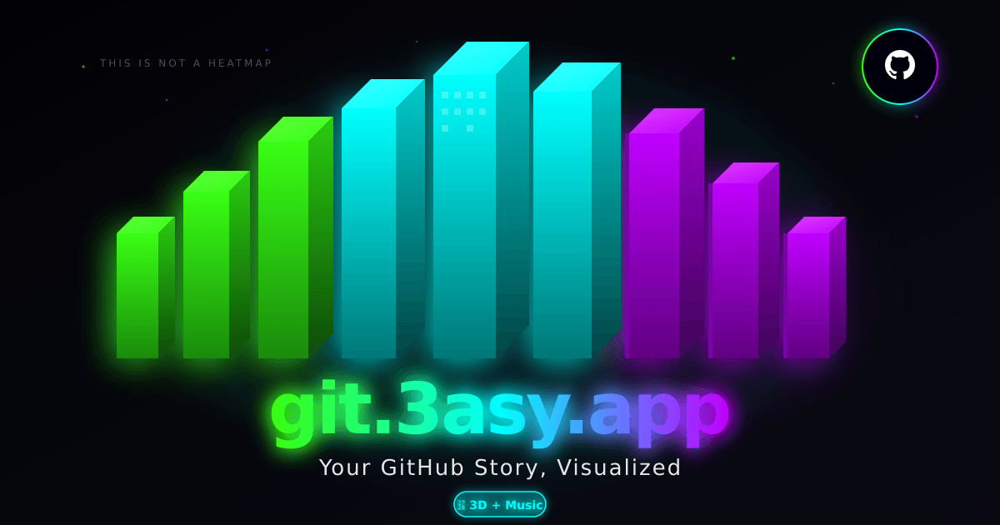

<div align="center">

# 🌆 git.3asy.app

### Your GitHub Story, Visualized

Transform your GitHub contributions into stunning 3D visualizations with generative music.

**This is not a heatmap.**

[](https://git.3asy.app)
[](https://github.com/michelemonti/3ASYGIT/stargazers)
[](LICENSE)

<br />



<br />

[](https://react.dev)
[](https://www.typescriptlang.org)
[](https://threejs.org)
[](https://vitejs.dev)
[](https://tailwindcss.com)

</div>

---

## ✨ Features

### 🏙️ Cinematic 3D Visualization
Your GitHub contributions transformed into a **neon cyberpunk city** - each commit builds the skyline, each contribution lights up the night.

### 🎵 Generative Audio System
Real-time procedural **synthwave music** that adapts to your contribution data. More commits = higher energy music.

### 🎚️ Dynamic Music Based on Activity

Each contribution count generates a **unique melody** with procedural synthesis!

| Contributions | Genre | BPM | Vibe |
|:-------------:|:-----:|:---:|:-----|
| 0-200 | 🌊 Chillout | 85-109 | Ambient, relaxed |
| 200-800 | 🔊 Techno | 110-127 | Groovy, steady |
| 800-2000 | 🌀 Trance | 128-139 | Melodic, euphoric |
| 2000-4000 | 💥 Hardstyle | 140-154 | Powerful, driving |
| 4000+ | 🔥 Hardcore | 155-180 | Intense, relentless |

> **Example:** @torvalds with ~3100 contributions → 💥 **Hardstyle @ 148 BPM**

### 📤 One-Click Sharing
Share your unique visualization on Twitter, LinkedIn, or copy the direct link to show off your coding journey.

---

## 🚀 Quick Start

### Try it Online
👉 **[git.3asy.app](https://git.3asy.app)** — Enter any GitHub username and watch the magic happen!

### Run Locally

```bash
# Clone the repository
git clone https://github.com/michelemonti/3ASYGIT.git
cd 3ASYGIT

# Install dependencies
npm install

# Start development server
npm run dev
```

Open [http://localhost:5173](http://localhost:5173) in your browser.

---

## 🎮 Controls

| Action | Control |
|:-------|:--------|
| Toggle Music | Press `M` or click 🔊 |
| Search User | Click 🔍 or type username |
| Share | Click 📤 |

---

## 🛠️ Tech Stack

| Technology | Purpose |
|:-----------|:--------|
| **React 18** | UI Framework |
| **TypeScript 5** | Type Safety |
| **Vite 5** | Build Tool |
| **React Three Fiber** | 3D Rendering |
| **Three.js** | WebGL Engine |
| **Framer Motion** | Animations |
| **TailwindCSS** | Styling |
| **Web Audio API** | Procedural Music |

---

## 📦 Project Structure

```
src/
├── components/
│   ├── ui/              # Reusable UI components
│   └── visualizations/  # 3D city visualization
├── lib/
│   ├── audioEngine.ts   # Generative music system
│   ├── githubService.ts # GitHub API integration
│   └── utils.ts         # Utility functions
├── types/               # TypeScript definitions
├── App.tsx              # Main application
└── main.tsx             # Entry point

public/
├── og-image.png         # Social sharing preview
├── manifest.json        # PWA manifest
├── favicon.svg          # App icon
└── robots.txt           # SEO
```

---

## 🌐 Deployment

### Build for Production

```bash
npm run build
```

Output will be in the `./dist` folder, ready to deploy to any static hosting.

### Recommended Platforms
- **Vercel** (recommended)
- **Netlify**
- **GitHub Pages**
- **Cloudflare Pages**

---

## 🤝 Contributing

Contributions are welcome! Feel free to:

1. Fork the repository
2. Create a feature branch (`git checkout -b feature/amazing-feature`)
3. Commit your changes (`git commit -m 'Add amazing feature'`)
4. Push to the branch (`git push origin feature/amazing-feature`)
5. Open a Pull Request

---

## 📄 License

This project is licensed under the **MIT License** - see the [LICENSE](LICENSE) file for details.

---

<div align="center">

### 🌟 Star this repo if you like it!

Made with 💜 by [MM@3ASY](https://3asy.app)

**[🚀 Try it now → git.3asy.app](https://git.3asy.app)**

</div>
